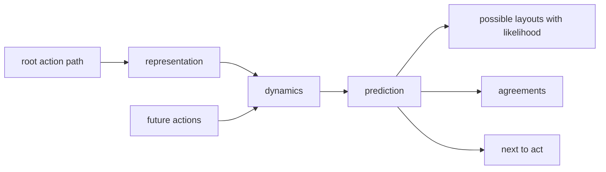
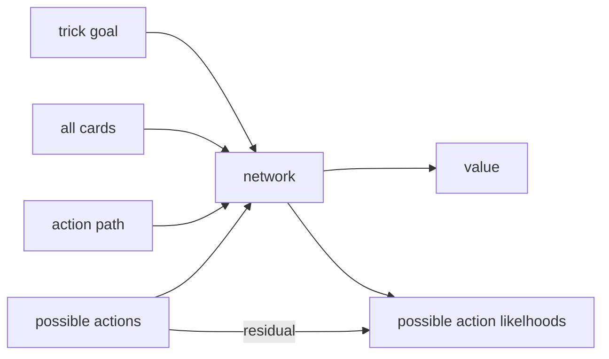
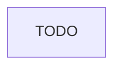

table view

double-dummy

single dummy

---
* What exactly do the pre- and post- processors do?
  * inputs:
    * par outcome guess, e.g.,
      `[["1", "notrump", "redoubled", "east", "-1"]]`
    * sequence of cards + actions, e.g.,
    ```
        [["West","was dealt", "Club", "Ace"],
        ...
        ["West", "plays", "Club", "Ace"]
        ...
    ]
    ```
  * preprocessor does embedding lookup on each uToken, adds them.
  * outputs:
    * policy
      * policy starts by querying each of the posible actions
      * cross-attention from perceiver latents
    * value >=
    * value >
    * revised par outcome.
  * how to get outputs:
    * for outcome:
      * use `chords.log_likelihood`
    * for `value_geq`, `value_gt`
      * use `chords.log_likelihood` to select between `[YES]`, `[NO]`
    * for policy:
      * use `chords.log_likelihood` to select between `[YES]`, `[NO]`
      * use `target_mask`, `log_softmax` to restricty to legal actions, normalize.
